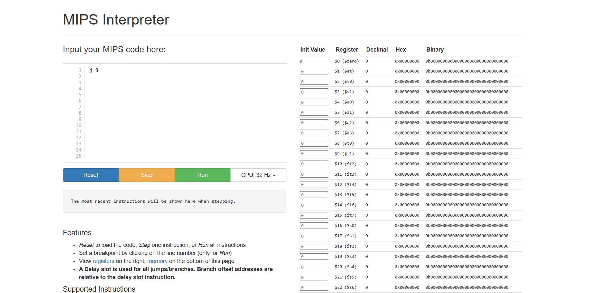

# Assembler

## Fachbegriffe

### High-Level Programming Language
High-Level Programming Languages sind Programmiersprachen die für Menschen leichter zu verstehen und zu schreiben ist. Das sind z.B.: Javascript, Python, C#,...

### Assembly Language
Programmiersprache die direkt mit der Maschine arbeitet. Auch gennant "Low-Level Programming Language". Assembly arbeitet mit Registern und Memory Adressen. Ein Beispiel wäre MIPS-Assembly language.

### Machine Language
Maschinensprache die mit einer serie von bits arbeitet um Rechenarbeiten und Logik zu berechnen und verarbeiten. Diese Befehle sind in dem Prozessor vorhanden.

### Abstraktionsebene bzw. Abstraktion, abstrahieren
Abstraktions ist die Trennung zwischen Konzept und Umsetzung.

### Instanzierung, was ist ein Instanz?
Instanzierung ist der Prozess des Lesens oder Angebens von Informationen, beispielsweise des Speichertyps und der Werte für ein Datenfeld. Eine Instanz ist eine Ausführungseinheit.

### Hexadecimal Code
Hexadecimal Code ist code das im hexadecimal Zahlensystem geschrieben wurde. Es kann im gegensatz zu Binären Code mehr zahlen speichern und braucht weniger platz.

## Konzepte

### Die "von Neumann" Architektur
Die "von Neumann" Architektur beschreibt das aufbau eines Prozessors und wie die einzelnen Komponente miteinander kommunizieren. Bei der Architektur sind dies die folgende Komponenten: 

Die "Control Unit" die den anderen Komponente Steuert und sagt was zu tun ist. 

Die "Arithmetic/Logic Unit" die Rechnungen und Logische Sequenzen ausführt. 

Die "Memory Unit" die dafür zuständig ist, die internen Speicher des Prozessors zu verwalten und für die anderen Komponente freizustellen.

Und die Register sind kleine speichereinheiten. Die Register sind am schnellestens zugreifbar von all den anderen Caches die der Prozessor zugriff hat.

Von: https://wissensplattform-schueler.de/von-neumann-architektur/

### MIPS-Assembler Language
Diese Webseite (https://dannyqiu.me/mips-interpreter/) erlaubt den Benutzer eine Simulierte CPU zu benutzen um MIPS-Assembly Programme laufen und auszuprobieren. 

Auf der webseite sind Register, rechts vom Textfeld. Man kann sehen ob im Register werte sind und man kann die Anfangswerte der Register auch ändern.

Am ende der Seite sind die Memory-Adressen, wo man sie eingeben kann und sehen ob etwas beinhaltet ist.

Der simulierte Prozessor kann bis 256 Hz haben.

Nur einige der MIPS-Assembly Instruktionen sind verfügbar.

## Assemblersprache

#### Instruction: 
Eine Instruction ist ein oder mehrere Befehle, die ausgeführt werden. Beinhaltet Mnemonic (einzelne Befehle)

#### Mnemonic: 
Eine einzelne Funktion oder Befehle die im Instruction beinhaltet sind. Jede Mnemonic repräsentiert eine Instruction oder OPCode. Z.B.: ADD

#### Instruction Encoding:
Die Konvertierung der Instruction in code die für Maschinen lesbar ist.
Instruction Format: Das Format der eingehalten werden muss damit die Instruction richtig von der Maschine ausgeführt werden kann.

#### OPCode: 
Ein Befehl wie MOV, ADD oder JMP. OPCode ist der Teil der Instruction der besagt was für eine „Operation“ ausgeführt wird. Die Instruction sagt auch die Daten, die sie prozessieren werden. Diese werden „Operands“ genannt.

#### Register: 
Register speichern, bewegen und verändern daten mit den Befehlen der Instruction.

#### Memory Address: 
Adresse die jede Memory hat.

#### Arithmetic: 
Befehle die mathematisch sind, z.B.: Addition, Subtraktion, Multiplikation usw.…

#### Move:
Befehle die Daten von einem Register zu dem anderen bewegen.

#### Shift:
Befehle die die Bits bitweise verschiebt. Z.B: zweimal nach links

#### Load:
Befehle, die die gespeicherten Daten laden, damit man sie verwenden kann.

#### Control: 
Funktionsaufrufe wie go to

#### Memory:
Anweisungen die direkt auf dem Speicher zugreifen. (daten speichern, lesen…)

## Register Naming Convention

0 – zero constant 0

1 – at – reserved for assembler

2 – v0 – expression evaluation &

3 – v1 – function results

4 – a0 – arguments bis 7 - a3 

8 – t0 – temporary: caller saves bis 15 – t7

15 – s0 – callee saves bis 23 – s7 

24 – t8 – temporary (cont´d) und 25 – t9

26 – k0 – reserved for OS-Kernel und 27 – k0 

28 – gp – Pointer to global area

29 – sp – Stack pointer

30 – fp – Frame pointer

31 – ra – Return Address (HW)

## Beschreibung des Aufbaus einer Assembly Instruktion
#### ADDU:
Die ADDU-Instruktion fügt einen 32-bit integer zu. Die 32-bit wertes Wort in GPR rt wird addiert zu dem 32-bit Wert im GPR rs und ist dann platziert im GPR rd. 
(rd ← rs + rt) 

ADDU $rd, $rs, $rt

## Umformen von 32-bit Befehlsätzen in Hexadecimal Code
ADDIU $0, $1, 5	=	0010,01 00,000 0,0001, 0000,0000,0000,0101 = 2 4 0 1 0 0 0 5

AND $1, $1, $1	=	0000,00 00,001 0,0001, 0000,1 000,0000,0000, = 0 0 2 1 0 8 0 0

BNE $0, $0, 32 = BNE rs, rt, offset = 0001,01 00,000 0,0000, 0000,0000,0010,0000, = 1 4 0 0 0 0 2 0

JUMP 8 = JUMP instr_index	=	,0000,10 00,0000,0000,0000,0000,0000,1000, = 0 8 0 0 0 0 0 8

## Übersetzung von Bitreihen in den zugehörigen MIPS-Befehle
(a) 00001100 00000000 00000000 00011010 = JAL 26 (Jump and Link)

(b) 100100,00 000,00010, 00001000 11001001 = LBU base rt offset (Load Byte Unsigned)

(c) 00000000 00000000 00010000 00010010 = SPECIAL 0 rd 0 MFLO (Move From LO Register)

(d) 00000000 10001000 00010000 00000111 = SPECIAL rs, rt, rd, 0 SRAV (Shift Word Right Arithmetic Variable)

(e) 00111000 11001001 00001110 10110101 = XORI rs, rt, immediate (Exclusive OR Immediate)

