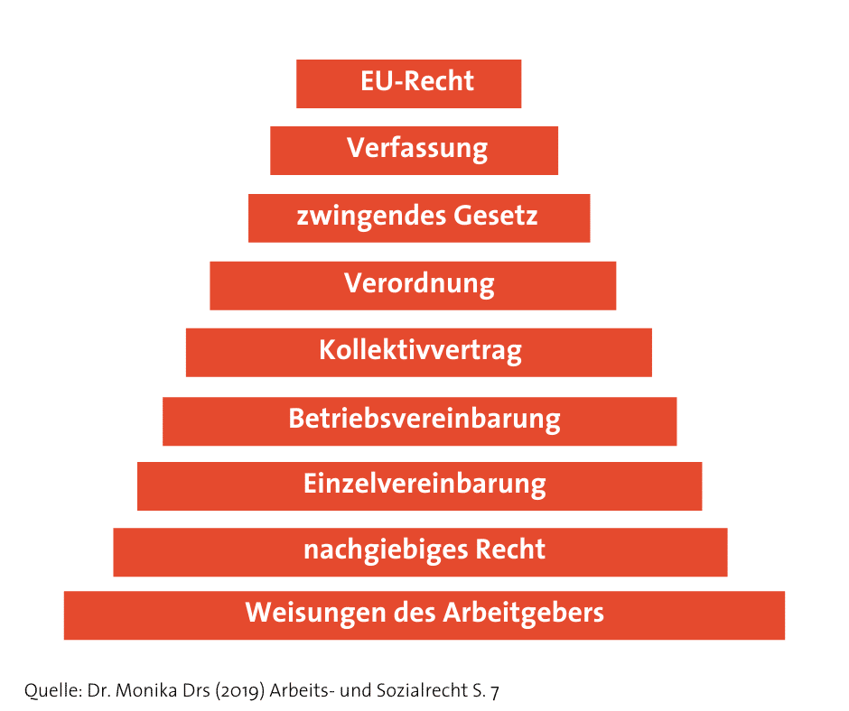
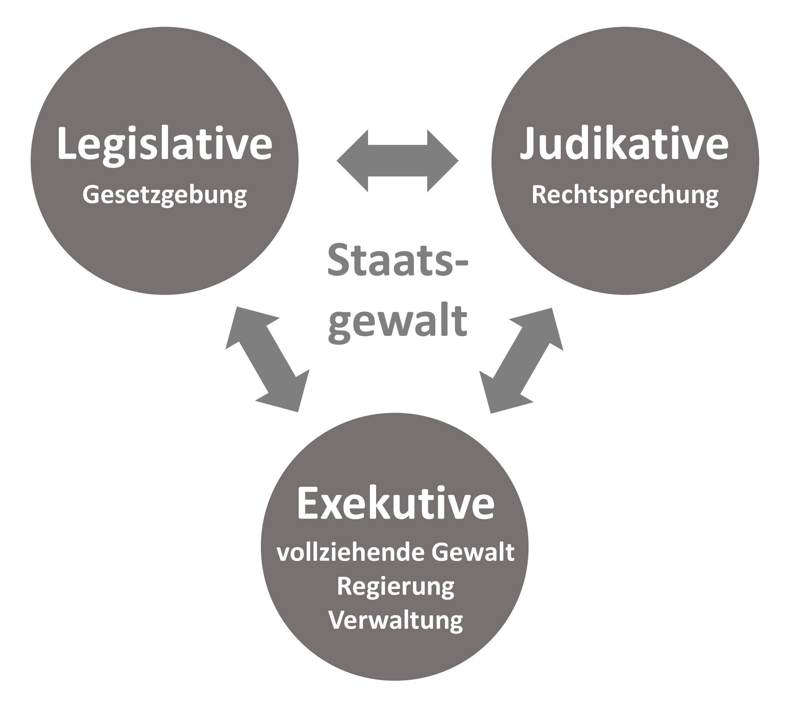

# Infobase (31.07.2024)
## 1. Grundlagen der Rechtssysteme

- (150W + Grafik) Aufbau Rechtssystem

Ein Rechtssystem wird so aufgebaut: An obersten Stelle ist die Verfassung, die die Grundprinzipien und die Struktur der Organisation des Staates definiert. Darauf aufbauend sind die legislative Organe, die Gesetze erlassen, die Regeln und Normen für das Zusammenleben festlegen. Diese Gesetze werden von Richtlinien und Verordnungen noch genauer beschrieben und detailiert. Verordnungen beschreiben die genaue und präzisieren die gesetzlichen Regelungen. Richtlinien geben konkrete Vorgaben für die Gesetze. Auf der untersten Ebene sind die administrative Anordnungen und Verfügungen, die von staatlichen Behörden zur konkreten Umsetzung der Gesetze im Alltag erlassen werden. 

- (50W pro Kategorie + Grafik) Stufenbau der Rechtsordnung

1. Verfassung
Die Verfassung eines Landes ist die wichtigste Gesetzgebung, die primäre rechtliche Grundlage sowie das grundlegende Rechtsdokument eines Landes. Sie umreißt die wesentlichen gesetzlichen Prinzipien, strukturellen Vorgaben des Staates sowie die in der Gesellschaft herrschenden Grundrechte und nimmt eine Beherrscherfunktion für Regelungen jedweder Art ein, ferner sie hat einen grundsätzlichen Vorzüglichkeitsgrad bezüglich allen weiteren Rechtsvorschriften im Verhältnis zu diesen inne.

2. Gesetze
Gesetze sind das Erzeugnis der legislative Gewalt und sie regeln spezielle gesellschaftliche Bereiche wie etwa das Strafrecht, das Zivilrecht oder das Verwaltungsrecht. Sie müssen der Verfassungsmäßigkeit genügen und basteln die Rahmenbedingungen der in der Verfassung enthaltenen Tendenzen aus sowie strukturieren sie näher. 

3. Verordnungen
Durch Verordnungen wird das Gesetz näher festgelegt und damit konkretisiert. Dabei wird festgelegt, was unter in einem Gesetz benutzten allgemeinen Begriffen bestimmte Sachverhalte und Vorfälle zu verstehen ist, um die Rechtsanwendung dadurch zu erleichtern und dadurch eine gleichmäßige Rechtsanwendung zu gewährleisten.

4. Verwaltung
Unter Verwaltungsanordnungen werden die Einzelheiten, in denen, in welcher Weise eine Rechtsnorm näher bestimme Punkte praktisch ausgeführt und angewendet werden sollen, festgelegt. Administrationen handeln sich dabei meist um die Anfeindung von Verwaltungsprozessen und der Verwaltung selbst. 

- (300W + Grafik) Gewaltenteilung 

Gewaltenteilung 
Die Gewaltenteilung ist ein grundlegendes Prinzip der modernen Demokratie, das die staatliche Macht in verschiedenen Organen aufteilt, um den Machtmissbrauch zu vermeiden und die Bürgerrechte zu schützen Perfect. 

Es gibt drei Hauptbereiche, in die die Gewaltenteilung in demokratischen Ländern unterteilt werden kann: die Legislative, die Exekutive und die Judikative.

1. Die Legislative.
Die Legislative regelt die Rechtsetzung und ermöglicht die Rechtsetzung. Zu dieser Gewalt gehören die gewählten Vertreter, die darauf abzielen, die notwendigen Gesetze zu entwickeln, um über sie zu diskutieren und sie zu genehmigen. In vielen Ländern gibt es zwei Kammern des Parlaments, beispielsweise in Deutschland gibt es zwei Parlamente: den Bundestag und den Bundesrat. In vielen anderen Ländern gibt es jedoch nur einen Zweitkammeron, darunter Österreich. Ihrerseits setzt sich der Bundestag aus Mitgliedern zusammen, die aller vier Jahre gewählt werden, und dies ist darauf zurückzuführen, dass die Interessen von Bürgern definiert und das allgemeine gesellschaftliche Leben auf gesetzlicher Grundlage geregelt werden.

2. Die Exekutive.
Die Exekutive muss die Gesetze schließlich interpretieren und anwenden. Die Exekutive besteht aus der Regierung und verschiedenen Verwaltungsbehörden, die die Gesetze im Aushandfällen umsetzen. Sie leitet die Gesetze nicht nur ein, sondern verwaltet auch öffentliche Angelegenheiten, Politiken und öffentliche Gelder. Beispiel für die Exekutive ist der Präsident sowie die
Regierungsbehörde.

3. Die Judikative
Die Judikative oder die Rechtsprechung interpretiert und wendet die Gesetze an. Sie ist unabhängig von der Legislative und Exekutive und stellt sicher, dass die Gesetze fair und gerecht angewendet werden. Gerichte überprüfen die Gesetze auf Einhaltung der Verfassung, entscheiden über Klagen und schützen die Rechte der Menschen. 

- (200W + 3 Beispiele) Öffentliches Recht

Öffentliches Recht ist das Recht der Bürger im zusammenhang mit dem Staat. Öffentliche Rechte sind Rechte wie das Völkerrecht, das Verwaltungsrecht, das Sozialrecht, das Prozessrecht, das Strafrecht oder auch das Arbeitsrecht.

Das Strafrecht: Beischreibt wenn eine Person fähig ist eine Straftat zu 

- (100W + 3 Beispiele) Privates Recht

- (100W + Beispiel anhand TKG) Aufbau eines Gesetzestext

- (75W per Term) Erkläre die Fachbegriffe: Verfassungsrecht, Unionsrecht, Gesetz, Verordnung, Anordnung, Bundesverfassung, Landesverfassung

## 2. Telekommunikationsgesetz

- (100W) Was ist das TKG?

   Das Telekommunikationsgesetz (TKG) ist ein Gesetz das die Bereitstellung und Nutzung von Telekommunikationsdiensten und -netzen regelt.  

- (100W) In welchem Sektor kommt das TKG zur Geltung?

Im Privaten und in Öffentlichen Sektor. Ich bin mir nicht sicher wie das bei dem Staat so is, aber vermute ich das Staatliche Organisationen und sonstige Organe deine Daten frei verarbeiten und für eine längere Zeit aufbehalten dürfen, solange du Services des Landes benutzt.

- (250W) Was sind Zweck und Ziele des TKG? Fasse den Abschnitt des Gesetzestextes zusammen

Das Telekommunikationsgesetz (TKG) hat den Zweck im Bereich der elektronischen Kommunikation die Versorgung der Bevölkerung und der Wirtschaft mit zuverlässigen, preiswerten, hochwertigen und innovativen Kommunikationsdienstleistungen zu gewährleisten. Dies soll in erster Linie durch Förderung des Wettbewerbs passieren. Das TKG zielt etwa darauf ab, den Zugang und die Nutzung von Netzen zu erleichtern, einen Beitrag zur Entwicklung des Binnenmarktes zu leisten, aber auch die Interessen der Bürger der Europäischen Union (EU) zu fördern.

TKG regelt die Möglichkeiten der Betreiber öffentlicher Mobilfunknetze, Kooperationen über die gemeinsame Nutzung aktiver Netzkomponenten oder über den Zugang zu den Funktionalitäten aktiver Netzkomponenten einzugehen. Unter aktiven Netzkomponenten sind dabei jene Bauteile zu verstehen, die mit elektrischer Energie betrieben werden und die für die Signalerzeugung, -verarbeitung und -verstärkung sowie die Netzsteuerung eingesetzt werden (zB aktive Antennen, Remote Radio Unit; Ausrüstung des Funkzugangsnetzes).

- (100W) Wie hoch sind circa die Kosten im Schadensfall?

Je nach grad sind im Schadensfall, können die kosten in die höhe von 100000€ hoch sein. 

## 3. Datenschutzrecht

- (100W) Was ist die DSGVO?

Die DSGVO ist die Datenschutzgrundverordnung. Die DSGVO regelt die persönliche Daten von Privatpersonen, Unternehmen, uvm... Diese persönliche Daten können sein z.B.: Adresse, Alter, Geburtsdatum, voller Name,...

- (200W) Was sind die Grundprinzipien der DSGVO?

Rechtmäßige Datenverarbeitung, Transparenz, Zweckbindung, Datenminimierung, Richtigkeit, Speicherbegrenzung, Integrität und Vertraulichkeit, Rechenschaftspflicht sind in Artikel 5 festgelegt.

Rechmäßige Datenverarbeitung: Rechtlich erlaubte erarbeitung meiner Daten, falls ich mich zustimme dafür. 
Transparenz: Was mit meiner Daten gemacht wird und wie sie veratbeitet werden, sind im Vertrag den Ich unterzeichnen muss, vorhanden.
Zweckbindung: Meine Daten dürfen nur für den Zweck vorauf ich mich enverstanden habe, verwendet werden.
Datenminimierung: Möglichst wenig Daten sollen von mir aufbehalten werden um die Arbeit fertigzustellen.
Richtigkeit: Die Daten müssen Richtig sein.
Speicherbegrenzung: Meine Daten dürfen nur bis zu 3 Jahre aufbewahrt werden. Danach werden sie gelöscht.
Integrität: Die Daten müssen Integrität haben.
Vertraulichkeit: Die Die meine Daten verarbeiten müssen Vertraulich mit meinen Daten umgehen und sie nicht weiterverkaufen oder frei geben. Unter verstoß der Vertraulichkeit muss man sehr große Geldstrafen bezahlen.
Rechenschaftspflicht: Pflicht die Daten zu berechnen.

- (100W) In welchem Sektor kommt die DSGVO zur Geltung?

Im privaten und im Öffentlichem Sektor.

- (250W) Was sind Zweck und Ziele der DSGVO? Fasse jeweilige Abschnitt des Gesetzestextes zusammen?

Das Ziel der DSGVO ist es, dem Nutzer die Datenhoheit zurückzugeben und Transparenz zu schaffen. Er soll informierte Entscheidungen darüber treffen können, was mit seinen Daten geschieht.

Diese Verordnung enthält Vorschriften zum Schutz natürlicher Personen bei der Verarbeitung personenbezogener Daten und zum freien Verkehr solcher Daten.
Diese Verordnung schützt die Grundrechte und Grundfreiheiten natürlicher Personen und insbesondere deren Recht auf Schutz personenbezogener Daten.
Der freie Verkehr personenbezogener Daten in der Union darf aus Gründen des Schutzes natürlicher Personen bei der Verarbeitung personenbezogener Daten weder eingeschränkt noch verboten werden.

- (50W pro Kategorie) Kategorien personenbezogener Daten

Adressdaten
Logindaten
Accountdaten
Bankdaten / Abrechnungsinformationen
Mitarbeiterdaten
Qualifikationsdaten
Positionsdaten
Versicherungsdaten
Persönliche Leistungsdaten
Nutzerdaten
Nutzungsdaten
Nutzungshistorie
Kommunikationsdaten
Nachrichteninhalte
Vertragsdaten
Kontaktdaten
Metadaten
Patientendaten
Behandlungsdaten
Stammdaten
Biometrische Daten
Abstammungsdaten
Besondere Kategorien personenbezogener Daten
Abodaten
Präferenzen und Vorlieben
Bilddaten / Videodaten
Audio- und Sprachdaten

- (100W) Wie hoch sind circa die Kosten im Schadensfall?

Im Schadensfall im bezug von der DSGVO sind sie Kosten wie man sich denkt, sehr hoch. Circa sind the kosten in der höhe von 20 Millionen Euro oder für Unternehmen von bis zu vier Prozent des weltweiten Jahresumsatzes vor (je nachdem, welcher Betrag am Ende höher ist). 

## 4. NIS-2 Direktive

- (100W) Was ist die NIS-2 Direktive?

Die NIS-2-Richtlinie regelt Cybersicherheit von Netzwerken und Informationssystemen in der EU. Dies erhöht die Sicherheit der Infrastruktur in der EU.

- (100W) In welchen Sektoren kommt die NIS-2 zur Geltung?

Sie gilt für Betreiber wesentlicher Dienste, wie Energieversorger, Banken, Gesundheitswesen, Wasserversorgung und digitale Infrastrukturen, sowie für digitale Dienstleister in der EU. D.h.: im privaten Sektor kommt die NIS-2 zu Geltung.

- (250W) Was sind Zweck und Ziele der NIS-2? 

Die NIS-2 Direktive regelt die Sicherheit von Netze und Informationssystemen in der EU. Ziel ist es, die Resilienz und Sicherheit von Infrastruktur zu verbessern und erhöhen.

- (100W) Wie hoch sind circa die Kosten im Schadensfall?

Circa sind die Kosten im Schadenfalls in die höhe von bis zu 2,2€ Mrd.

## 5. Nutzungsrecht

- (100W) Was konkret heißt Nutzungsrecht?

Dieses Recht erlaubt der innehabenden Person die Nutzung oder den Gebrauch einer Sache oder eines Rechts. 

- (5 Kategorien, 50W per Kategorie) Welche Teilbereiche befinden sich Nutzungsrecht?

- (100W + 200W) Proprietäre und Open-Source Lizensen

Proprietäre Lizensen sind Lizensen die von Firmen ausgegeben werden für die benutzung von ihrer Software. Diese Software sind erlauben öfters keine veränderungen der Software und den Quell-Code kann man nicht einschauen.

Open-Source Lizensen sind Lizensen die erlauben das jeder sich eine Software herunterladen darf und benutzen darf. Open-Source Lizensen erlauben oftmals die weiterverbreitung von Software ohne die Hersteller zu fragen. Man darf auch den Quell-Code einsehen und ihn frei verändern und modifizeren, um die Software nach deinen eigenem schema zu verändern oder sogar eine neue Software zu erstellen die die erste als basis hat. (In Diesem falle muss man nachschauen ob die genaue Lizense das erlaubt, und diese Software kann dann auch eine Open-Source Lizense haben)

- (75W + 3 Beispiele per Term) Erkläre die Fachbegriffe: Copyright, Copyleft, Trademark, Rights Reserved

Copyright ist das die erstellte Digitelle Datei dem rechtlichen Eigentümer gehört der sie erstellt hatte. z.B.: Windows ist copyright von Microsoft, die die erfunden hat. Fotos die Fotografiert wurden gehören den Fotografen. Bücher die von Autoren erstellt wurde gehört den Autoren der das erstellt hat usw...

- (250W) Beschreibe übliche Servicevertrag-Vereinbarungen am Beispiel Microsoft.

- (75W per Term) Beschreibe gängige Open-Source Lizensen: MIT, GPL, CC, BSD, Apache-2

- (100W) Wie hoch sind circa die Kosten im Schadensfall für proprietäre Software?

- (200W) Wie hoch sind circa die Kosten im Schadensfall für open-source Software?

